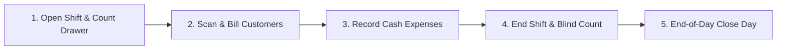

# 🥥 Mangalore Store POS System

> **High-Performance, Offline-First Point of Sale & Inventory Management System for Coastal Karnataka Retail.**
> Built with React 18, TypeScript, Tailwind CSS, Express, `better-sqlite3` (WAL Mode, Append-Only Triggers), and In-Memory MiniSearch.

---

## 🌟 Key Highlights & Architectural Strengths

- **⚡ Sub-50ms Search Performance**: In-memory MiniSearch index with prefix, typo tolerance, barcode scanner capture, and local Kannada/Tulunadu alias matching across 5,000+ products.
- **🛡️ 100% Offline-First & Bulletproof Data Safety**: Runs completely local on SQLite in WAL mode (`PRAGMA synchronous = FULL`, `foreign_keys = ON`). Zero external CDN dependencies at runtime.
- **🔒 Immutable Audit Trail & Ledger Integrity**: All inventory movements and audit logs are strictly append-only (protected by SQLite database triggers prohibiting `UPDATE`/`DELETE`) with cryptographic SHA-256 hash chaining.
- **💰 Shift & Cash Drawer Accountability**: Tracks opening cash, cash sales, UPI/card collections, shop expenses (milk, tea, auto), expected drawer cash calculation, and blind count shift closing with discrepancy tracking.
- **⏱️ "While You Were Away" Inspector**: Instant activity summary when the owner returns (total sales, cash vs UPI, worker discounts, custom items sold, and voids).
- **📝 Mid-Bill Unlisted Custom Items**: Sell unlisted items on the fly with automatic tracking in the "Custom Items to Review" admin queue for 1-click product conversion.
- **🤝 On-The-Spot Price Negotiation & Discounts**: "Set Final Price" helper (e.g. ₹85 down to ₹80) with integer-paise proportional discount distribution across cart lines and inline Admin PIN elevation.
- **📊 Thermal & Standard Receipts**: Native support for 58mm, 80mm thermal receipt printers, A4 invoices, duplicate receipt stamping, and 1-click WhatsApp web sharing.

---

## 🚀 Quick Start & Development

### 1. Prerequisites
- **Node.js**: v18.0.0 or higher
- **npm**: v9.0.0 or higher

### 2. Installation
```bash
# Clone or navigate to the project directory
git clone https://github.com/Ankith-gangadhar/BillingSystem.git
cd BillingSystem

# Install all dependencies
npm install
```

### 3. Running the App in Development
```bash
# Starts both Express backend (port 3001) and Vite React frontend (port 5173)
npm run dev
```
Open **`http://localhost:5173`** in your browser.

---

## 🔑 Default Demo Users & PINs

| Role | User Name | Default PIN | Permissions |
| :--- | :--- | :--- | :--- |
| **Admin / Owner** | Ankith | `1234` | Full access (Inventory, profit, reports, voids, audit, backup, settings) |
| **Worker / Cashier** | Raju | `0000` | POS billing, custom items, discounts up to 5%, shift closing |
| **Mother (Cashier)** | Mother | `1111` | Simplified large-touch billing, scanning, receipts |

---

## 🏪 Daily Store Routine Guide



1. **Start Shift**:
   - Log in with your PIN (`0000` or `1234`).
   - Enter opening cash counted in the till drawer (e.g. `₹1,000.00`).
2. **Billing**:
   - Focus search with `/` or `F2`. Type 2 letters or scan barcode.
   - Press `Enter` to add.
   - Press `F4` to add unlisted custom items.
   - Press `F8` to set negotiated final price.
   - Press `F9` to take payment (Cash / UPI / Card / Split) and print receipt.
3. **Record Mid-Day Cash Expenses**:
   - In "My Shift", click "Record Drawer Expense" (e.g. `₹60 for milk`) so expected drawer cash stays accurate.
4. **End Shift Handover**:
   - Click "Close Shift" and enter actual counted cash. The system records any shortage/excess.
5. **End-of-Day Closing (Close Day)**:
   - Admin clicks "Close Day" to generate an immutable snapshot for accounting and taxes.

---

## 📂 Architecture Overview (3-Tier MVC)

```
/BillingSystem
├── /server
│   ├── /controllers     # HTTP request handlers & validation
│   ├── /services        # Core domain business logic (bills, discounts, shifts, audit)
│   ├── /repositories    # SQLite prepared statement queries and data access
│   ├── /db              # Schema, migrations, triggers, and seed scripts
│   ├── /middleware      # JWT auth, cashier data sanitizers, role guards
│   └── index.ts         # Express server entry point
├── /src                 # React 18 + Vite + Tailwind CSS Frontend
│   ├── /components      # POS search, cart, quick tiles, modals, receipts
│   ├── /context         # AuthContext & PosContext state providers
│   ├── /pages           # Responsive views (Billing, Dashboard, Inventory, etc.)
│   └── /utils           # Formatters, sound synthesizer, API client
├── /shared              # TypeScript types & DTO contracts
├── /electron            # Electron desktop window wrapper & silent printer IPC
└── /tests               # Vitest unit, integration, and 5k-product performance tests
```

---

## 🧪 Testing & Validation

```bash
# Run the complete test suite
npm test
```
All unit tests, financial calculations, audit triggers, and 5,000-product search latency tests (<50ms) will execute and report results.
